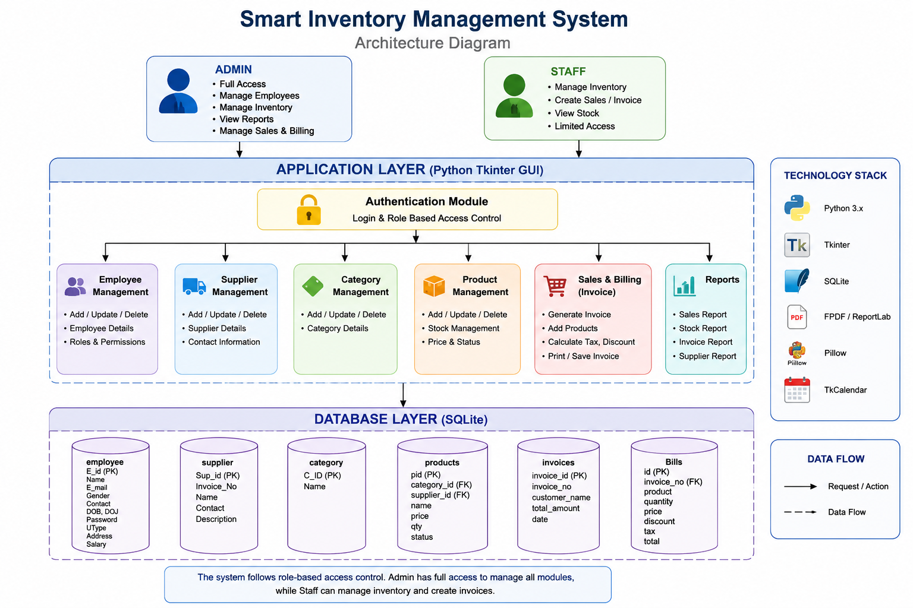
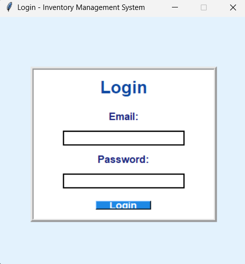
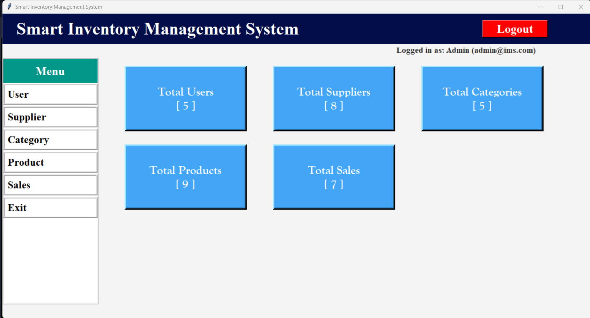
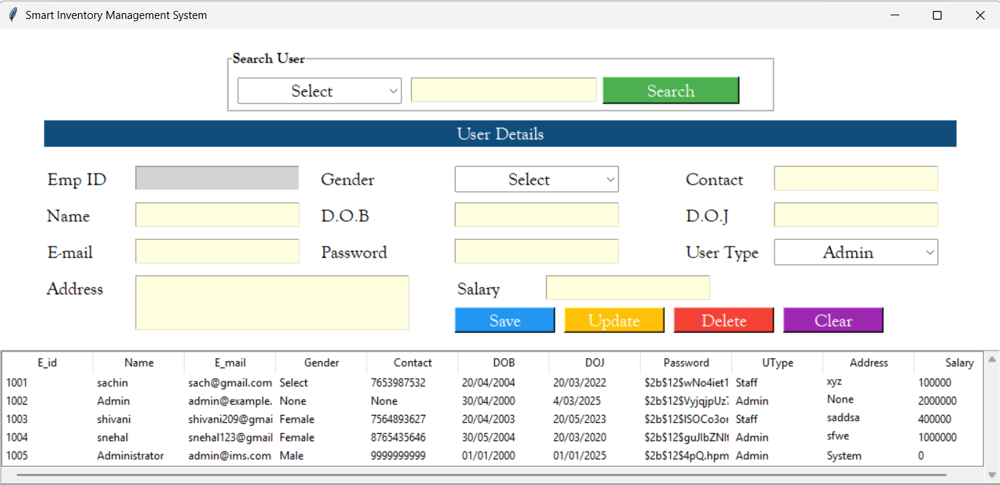
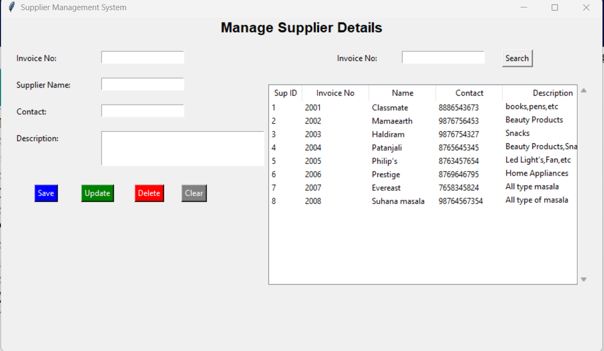
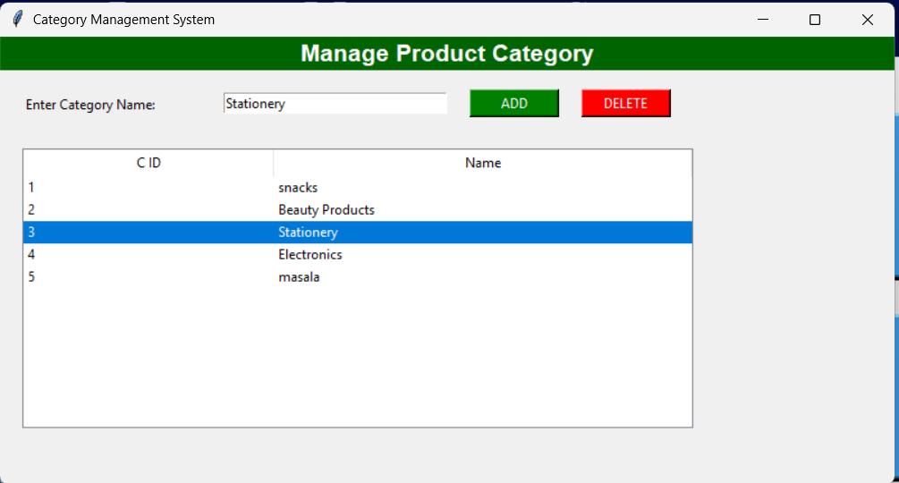
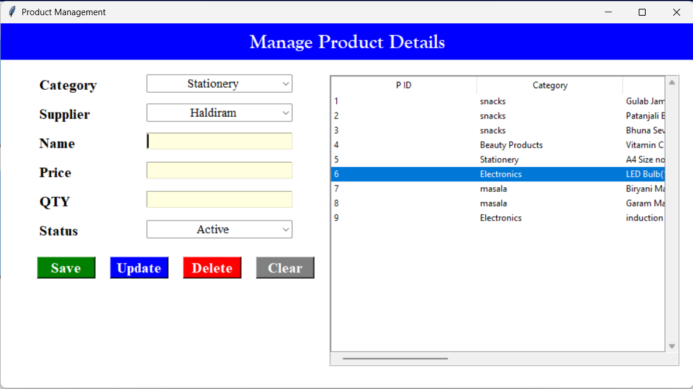
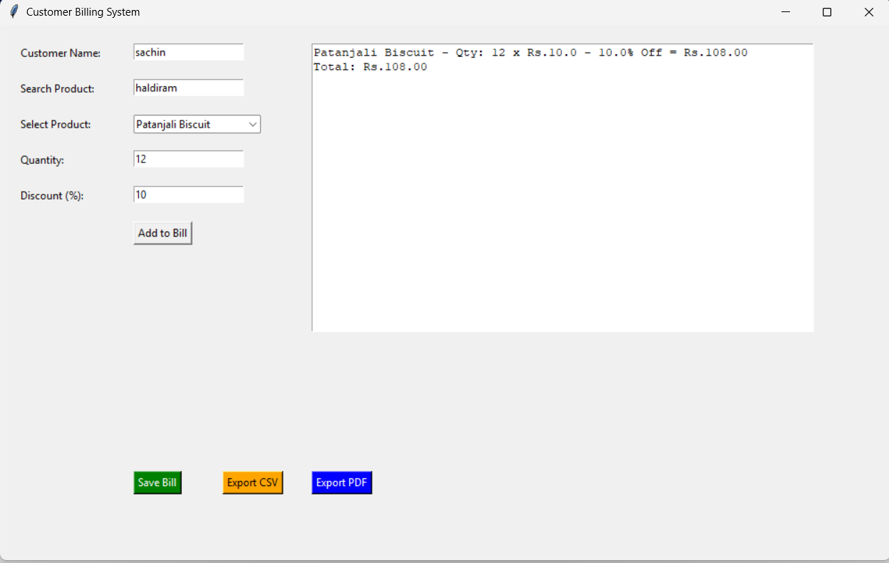

# 📦 Smart Inventory Management System

### Desktop-Based Inventory, Billing & Stock Management Application

Smart Inventory Management System is a desktop application developed using Python, Tkinter, and SQLite to simplify inventory management for small and medium-sized businesses. The application enables administrators and staff to manage employees, suppliers, product categories, inventory, sales, and billing through an easy-to-use graphical interface.

The project demonstrates practical implementation of desktop application development, role-based authentication, inventory management, billing, database operations, and report generation using Python.

---

# 📖 Project Overview

The Smart Inventory Management System provides a centralized platform for managing daily inventory operations. Users can securely log in, maintain employee records, manage suppliers and product categories, update stock information, generate invoices, and monitor sales.

The application stores all business data in a SQLite database, making it lightweight, portable, and suitable for desktop environments.

This project was developed as a final-year academic project to demonstrate practical software engineering concepts using Python.

---

# 🎯 Objectives

- Simplify inventory management
- Maintain accurate stock records
- Manage suppliers and employees
- Generate sales invoices
- Reduce manual inventory errors
- Demonstrate desktop application development using Python

---

# ✨ Features

- 🔐 Secure Login System using BCrypt Password Hashing
- 👥 Employee Management
- 🚚 Supplier Management
- 📂 Category Management
- 📦 Product Management
- 📊 Inventory & Stock Tracking
- 🧾 Sales & Billing System
- 📄 Invoice Generation (PDF)
- 💾 SQLite Database Integration
- 🖥️ User-Friendly Tkinter Interface
- 🔍 Search & Update Records
- 🗑️ Add, Edit and Delete Operations

---

# 👤 User Roles

## 👨‍💼 Administrator

The administrator has full access to the application and can:

- Manage employees
- Manage suppliers
- Manage product categories
- Manage products
- Monitor inventory
- Generate invoices
- Access all system modules

---

## 👨‍💻 Staff

Staff members can:

- Log in securely
- Manage products
- Update stock
- Generate sales invoices
- View inventory information

---

# ⚙️ Key Functionalities

### 🔐 Authentication

Users log in securely using BCrypt encrypted passwords and role-based authentication.

### 📦 Inventory Management

Maintain product details, stock quantity, categories, suppliers, and pricing.

### 🧾 Billing System

Generate invoices, calculate totals, and create printable PDF bills.

### 📊 Database Management

Store employee, supplier, product, inventory, and billing information using SQLite.

---
# 🏗️ System Architecture

<p align="center">

</p>

The application follows a desktop-based architecture where administrators and staff interact with a graphical user interface to manage inventory operations. The application processes user actions, performs business logic, and stores all information in a SQLite database.

### Workflow

```
Administrator / Staff
          │
          ▼
      Login System
          │
          ▼
 Python Tkinter GUI
          │
          ▼
────────────────────────────
 Employee Management

 Supplier Management

 Category Management

 Product Management

 Sales & Billing

 Report Generation
────────────────────────────
          │
          ▼
      SQLite Database
```

---

# 🛠️ Technology Stack

## Backend

| Technology | Purpose |
|------------|---------|
| Python 3 | Programming Language |
| SQLite | Database |
| BCrypt | Password Encryption |
| FPDF | Invoice Generation |

---

## Frontend (Desktop GUI)

| Technology | Purpose |
|------------|---------|
| Tkinter | Desktop User Interface |
| Pillow | Image Processing |
| TkCalendar | Date Selection |

---

## Database

| Technology | Purpose |
|------------|---------|
| SQLite | Store Employee, Supplier, Product and Sales Data |

---

## Development Tools

| Tool | Purpose |
|------|---------|
| VS Code | Code Editor |
| Git | Version Control |
| GitHub | Repository Hosting |

---

# 📸 Application Screenshots

## 🔐 Login

<p align="center">

</p>

Secure login using BCrypt password authentication.

---

## 🏠 Admin Dashboard

<p align="center">

</p>

The administrator dashboard provides quick access to employee, supplier, category, product, inventory, and billing management.

---

## 👥 Employee Management

<p align="center">

</p>

Manage employee records including adding, updating, searching, and deleting employees.

---

## 🚚 Supplier Management

<p align="center">

</p>

Maintain supplier details and contact information used for inventory management.

---

## 📂 Category Management

<p align="center">

</p>

Create and manage product categories for better inventory organization.

---

## 📦 Product Management

<p align="center">

</p>

Manage product information including pricing, stock quantity, supplier, and category.

---

## 🧾 Sales & Billing

<p align="center">

</p>

Generate invoices, calculate totals, and manage customer billing efficiently.

---
# 📂 Project Structure

```
Smart-Inventory-Management
│
├── architecture/
├── screenshots/
├── bill_txt/
├── login.py
├── dashbord.py
├── employee.py
├── supplier.py
├── category.py
├── product.py
├── sales_billing.py
├── create_db.py
├── migrate_passwords.py
├── ims.db
├── requirements.txt
├── .gitignore
└── README.md
```

---

# ⚙️ Installation Guide

## 1. Clone the Repository

```bash
git clone https://github.com/Sachingupta209/Smart-Inventory-Management.git

cd Smart-Inventory-Management
```

---

## 2. Install Required Packages

```bash
pip install -r requirements.txt
```

---

## 3. Initialize the Database

If the database does not already exist, run:

```bash
python create_db.py
```

---

## 4. Launch the Application

```bash
python login.py
```

---

# 🔄 Application Workflow

The Smart Inventory Management System follows the workflow below:

### Step 1

User logs into the application.

↓

### Step 2

The system verifies login credentials.

↓

### Step 3

The administrator or staff accesses the dashboard.

↓

### Step 4

Manage employees, suppliers, categories, and products.

↓

### Step 5

Maintain inventory and update stock levels.

↓

### Step 6

Generate customer invoices.

↓

### Step 7

Store all records securely in the SQLite database.

---

# 🔒 Security Features

- BCrypt Password Hashing
- Role-Based Authentication
- Secure SQLite Database Storage
- Input Validation
- Inventory Data Protection

---

# 📌 Core Modules

### 🔐 Authentication Module

Provides secure login with BCrypt password hashing and role-based access.

---

### 👥 Employee Management

Manage employee records, roles, contact details, and salary information.

---

### 🚚 Supplier Management

Store and manage supplier information used for inventory operations.

---

### 📂 Category Management

Create and organize product categories.

---

### 📦 Product Management

Manage product details, pricing, suppliers, and stock quantity.

---

### 🧾 Sales & Billing

Generate customer invoices, calculate totals, and create PDF bills.

---

### 💾 Database Module

Stores employee, supplier, category, product, invoice, and billing data using SQLite.

---
# 🚀 Future Enhancements

The following features can be added in future versions of the application:

- 🔔 Low Stock Alert Notifications
- 📱 Mobile Application
- ☁️ Cloud-Based Inventory Management
- 📊 Interactive Dashboard with Charts
- 📷 Barcode Scanner Integration
- 📧 Email Invoice Delivery
- 📈 Advanced Sales Analytics
- 🧾 GST Invoice Generation
- 📤 Export Reports to Excel & PDF
- 🔄 Automated Database Backup
- 👥 Multi-Branch Inventory Management
- 🔐 Two-Factor Authentication (2FA)

---

# 🌍 Project Status

> ✅ Completed

The Smart Inventory Management System successfully demonstrates:

- Desktop Application Development
- Role-Based Authentication
- Inventory & Stock Management
- Employee Management
- Supplier Management
- Category Management
- Sales & Billing
- PDF Invoice Generation
- SQLite Database Integration
- Responsive Desktop GUI

---

# 💡 Learning Outcomes

This project helped strengthen practical knowledge in:

- Python Programming
- Desktop Application Development
- Tkinter GUI Design
- SQLite Database Management
- CRUD Operations
- Authentication & Authorization
- Password Encryption using BCrypt
- File Handling
- Software Architecture
- Git & GitHub

---

# 📄 Repository Information

| Item | Details |
|------|---------|
| Project | Smart Inventory Management System |
| Project Type | Desktop Application |
| Language | Python |
| GUI Framework | Tkinter |
| Database | SQLite |
| Version Control | Git & GitHub |

---

# 👨‍💻 Author

**Sachin Gupta**

Backend Developer | Java | Python | Cloud & DevOps Enthusiast

### Technologies

- Java
- Spring Boot
- Python
- Django
- Tkinter
- PostgreSQL
- SQLite
- React
- Docker
- AWS
- Git
- GitHub

GitHub:

https://github.com/Sachingupta209

---

# 🤝 Contributing

Contributions are welcome.

If you'd like to improve the project:

1. Fork the repository.
2. Create a feature branch.
3. Commit your changes.
4. Submit a Pull Request.

---

# ⭐ Support

If you found this project useful, consider giving it a ⭐ on GitHub.

Your support helps improve the project and makes it easier for others to discover it.

---

<div align="center">

## 📦 Smart Inventory Management System

### Desktop-Based Inventory, Billing & Stock Management Application

**Built with Python, Tkinter & SQLite**

</div>
